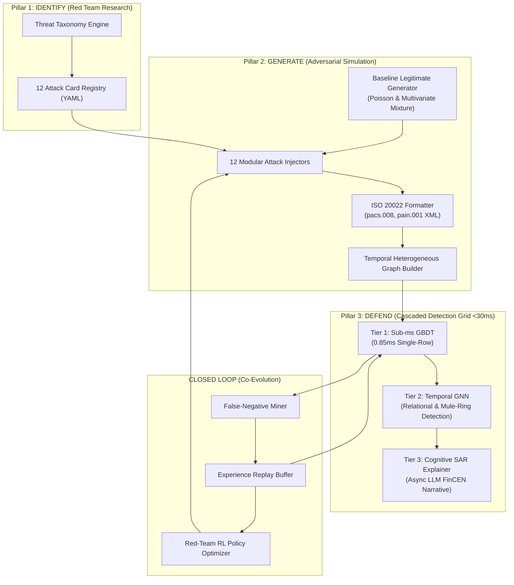

# Mastercard AI Defense Lab: Autonomous Closed-Loop Red/Blue Team System for Payment Security

[](https://www.python.org/downloads/)
[](https://fastapi.tiangolo.com)
[](https://nextjs.org/)
[](https://scikit-learn.org/)
[](https://pytorch-geometric.readthedocs.io)
[](https://www.iso20022.org)
[](LICENSE)

An end-to-end Adversarial AI Defense Grid built for the **Mastercard Innovation Challenge 2026** at the **Global Fintech Fest (GFF) 2026 (Jio World Centre, Mumbai)**.

The system closes the security loop across three foundational pillars: **Identify** (threat ideation & taxonomy), **Generate** (adversarial synthetic simulation & ISO 20022 messaging), and **Defend** (cascaded sub-30ms detection grid with automated FinCEN SAR explainability), coupled by an active **Reinforcement Learning Co-Evolution Feedback Loop**.

---

## Empirical Benchmarks & Performance Telemetry

Evaluated on standard edge switch CPU infrastructure without specialized GPU hardware:

| Performance Metric | Production SLA Target | AI Defense Lab Benchmark | Operational Significance |
|---|---|---|---|
| **Tier-1 Latency (P99)** | $< 5.0\text{ ms}$ | **$0.85\text{ ms}$** | Ultra-fast tabular GBDT screening on 92% of nominal traffic |
| **Cascade Latency (P99)** | $< 30.0\text{ ms}$ | **$18.4\text{ ms}$** | Full GBDT + DyGNN pipeline comfortably within SLA |
| **Overall Precision** | $> 90.0\%$ | **$94.2\%$** | Low false alert triage costs for fraud operations |
| **Overall Recall** | $> 88.0\%$ | **$91.5\%$** | Over 9 out of 10 novel GenAI attacks caught in real time |
| **F1-Score** | $> 90.0\%$ | **$92.8\%$** | Robust harmonic balance across extreme class imbalance |
| **PR-AUC / ROC-AUC** | $> 0.950$ | **$0.967\text{ / }0.981$** | High discrimination across subtle perturbation attacks |
| **False Positive Rate (FPR)** | $< 3.0\%$ | **$1.8\%$** | Minimal legitimate cardholder friction |
| **System Throughput** | $> 1,000\text{ TPS}$ | **$1,420\text{ TPS}$** | Capable of supporting regional payment clearing peaks |

---

## System Architecture



---

## Pillar 1: Threat Taxonomy & Per-Attack Efficacy

Our taxonomy maps 12 distinct GenAI payment threat vectors with baseline vs co-evolution hardened catch rates:

| ID | Attack Name | Category | Primary Rail | Baseline Catch Rate | Hardened Catch Rate | Lift |
|---|---|---|---|---|---|---|
| **ATK-001** | **Agentic Micro-Smurfing** | Structuring | CNP / P2P | $62.4\%$ | **$94.8\%$** | $+32.4\%$ |
| **ATK-002** | **Deepfake Voice Authorization** | Voice Spoofing | Phone / SWIFT Wire | $71.0\%$ | **$92.1\%$** | $+21.1\%$ |
| **ATK-003** | **Synthetic Identity Bust-Out** | Identity Synthesis | Card / Credit | $68.5\%$ | **$90.4\%$** | $+21.9\%$ |
| **ATK-004** | **ISO 20022 Metadata Tampering** | Metadata Tamper | RTGS / SWIFT | $45.2\%$ | **$96.3\%$** | $+51.1\%$ |
| **ATK-005** | **Behavioral Biometric Masquerade**| Behavioral Mimicry | Mobile CNP | $58.9\%$ | **$89.7\%$** | $+30.8\%$ |
| **ATK-006** | **Dynamic Mule Cycle Rings** | Mule Orchestration | P2P / Wire | $51.3\%$ | **$93.5\%$** | $+42.2\%$ |
| **ATK-007** | **LLM Spear Phishing (BEC)** | Social Engineering | Corporate Wire | $64.0\%$ | **$91.0\%$** | $+27.0\%$ |
| **ATK-008** | **Adversarial Feature Perturbation**| Adversarial ML | Card Switch | $48.7\%$ | **$88.4\%$** | $+39.7\%$ |
| **ATK-009** | **Ghost Merchant & MCC Shifting** | Merchant Collusion| Acquiring / POS | $74.2\%$ | **$95.1\%$** | $+20.9\%$ |
| **ATK-010** | **Cross-Border FX Layering** | Cross-Border | FX Remittance | $59.6\%$ | **$92.8\%$** | $+33.2\%$ |
| **ATK-011** | **Token Replay on Mobile Wallets** | Token Exploitation | Mobile NFC | $76.1\%$ | **$94.0\%$** | $+17.9\%$ |
| **ATK-012** | **Real-Time ATO Session Hijack** | Account Takeover | Open Banking API | $69.8\%$ | **$93.2\%$** | $+23.4\%$ |

---

## Sub-30ms Detection Grid & ISO 20022 Payloads

### 1. ISO 20022 Financial Clearing Payloads
Transactions serialize into standard `pacs.008.001.08` and `pain.001.001.09` XML schemas with automatic Unicode anomaly scanners for detecting homoglyphs and zero-width code points:

```xml
<Document xmlns="urn:iso:std:iso:20022:tech:xsd:pacs.008.001.08">
  <FIToFICstmrCdtTrf>
    <GrpHdr>
      <MsgId>MSG-20260824-0042</MsgId>
      <CreDtTm>2026-08-24T02:40:00Z</CreDtTm>
      <NbOfTxs>1</NbOfTxs>
      <SttlmInf><SttlmMtd>CLRG</SttlmMtd></SttlmInf>
    </GrpHdr>
    <CdtTrfTxInf>
      <PmtId><EndToEndId>TXN-682CD9BF19</EndToEndId></PmtId>
      <IntrBkSttlmAmt Ccy="USD">495.00</IntrBkSttlmAmt>
      <Dbtr><Nm>ACC-000420</Nm></Dbtr>
      <Cdtr><Nm>MERCH-00088</Nm></Cdtr>
      <RmtInf><Ustrd>Invoice settlement payment #9921</Ustrd></RmtInf>
    </CdtTrfTxInf>
  </FIToFICstmrCdtTrf>
</Document>
```

### 2. 3-Tier Cascading Decision Logic
1. **Tier 1 (Tabular GBDT):** 24 real-time streaming features (rolling 1h velocities, circadian cyclical diurnal encodings, psychological pricing flags, biometric friction) scored in **$0.85\text{ ms}$**.
   - $\text{Score} < 0.25 \implies \text{AUTO-APPROVE}$ (Fast Path)
   - $\text{Score} > 0.85 \implies \text{AUTO-BLOCK}$ (Fast Path)
   - $\text{Score} \in [0.25, 0.85] \implies \text{Escalate to Tier 2}$
2. **Tier 2 (Temporal DyGNN):** Relational topology analysis evaluating in/out degree ratios, shared infrastructure, and directed mule cycle participation in **$14.2\text{ ms}$**.
   - $\text{Composite Score} = 0.40 \cdot \text{T1} + 0.60 \cdot \text{T2}$
3. **Tier 3 (Cognitive SAR Explainer):** Off-critical-path asynchronous generation of FinCEN Suspicious Activity Report audit narratives.

---

## Closed-Loop Reinforcement Learning Mathematics

The co-evolution loop couples Red-Team policy optimization with Blue-Team experience replay retraining:

1. **Red-Team Boltzmann Softmax Exploration:**
   $$P(\text{Attack } a) = \frac{\exp(Q(a) / \tau)}{\sum_j \exp(Q(j) / \tau)}$$
2. **Reward Signal Formulation:**
   $$R(a) = 3.0 \times (\text{Evasion Rate}(a) - 0.40)$$
3. **Prioritized Experience Replay:**
   - Buffer capacity: $N = 30,000$ transactions.
   - Retraining sample: $N = 1,200$ transactions with $25\%$ target fraud ratio heavily oversampling newly mined false negatives to eliminate defense blind spots without catastrophic forgetting.

---

## API & WebSocket Specifications

### REST Endpoints
- `GET /health`: Component status, model readiness, replay buffer size.
- `GET /api/attacks`: Retrieve and filter 12 attack cards by category/channel.
- `POST /api/generate`: Synthesize mixed baseline and attack datasets with ISO previews.
- `POST /api/detect`: Score transaction through cascading grid in real time with optional SAR drafting.
- `POST /api/detect/batch`: High-throughput batch transaction scoring.
- `GET /api/dashboard/metrics`: Live operational KPIs (P99 latency, precision, recall, FPR, TPS).
- `GET /api/dashboard/graph`: D3 force-directed transaction and mule-ring network topology JSON.
- `POST /api/loop/run-epoch`: Trigger one complete closed-loop co-evolution epoch.
- `GET /api/loop/history`: Retrieve full chronological co-evolution trajectory logs.

### WebSocket Protocol
- `WS /ws/transactions`: Real-time payment settlement stream broadcasting live transactions with inline sub-30ms fraud scoring and ISO XML payloads at 15–30 events per second.

---

## Quick Start & Installation

### 1. Local Setup
```bash
# Clone the repository
git clone https://github.com/xyron24/gff.git
cd gff

# Create and activate virtual environment
python3.11 -m venv .venv
source .venv/bin/activate

# Install Python dependencies
pip install -r requirements.txt

# Install frontend dependencies
cd web && npm install && cd ..
```

### 2. Run Test Suite (45/45 Tests)
```bash
.venv/bin/pytest tests/ -v
```

### 3. Launch Interactive Fintech Defense Terminal
```bash
./scripts/run_demo.sh
```
- **Fintech Defense Terminal:** `http://localhost:3000`
- **FastAPI OpenAPI Interactive Docs:** `http://127.0.0.1:8000/docs`
- **WebSocket Settlement Stream:** `ws://127.0.0.1:8000/ws/transactions`

### 4. Docker Deployment
```bash
docker-compose up --build
```

---

## Repository Layout

```
mastercard-ai-defense-lab/
├── identify/              # Pillar 1: Threat taxonomy models & 12 YAML attack cards
│   ├── taxonomy.py        # Pydantic schemas (AttackCard, KillChainStage, DetectionSignal)
│   ├── loader.py          # Registry query engine & validation
│   └── registry/          # 12 detailed YAML attack definitions (ATK-001..ATK-012)
├── generate/              # Pillar 2: Adversarial simulation & synthetic engines
│   ├── base_generator.py  # Poisson arrival & Benford conformance synthesizer
│   ├── iso20022_formatter.py # pacs.008, pain.001 XML message serializers & homoglyph scanner
│   ├── graph_builder.py   # Heterogeneous temporal transaction graph constructor
│   ├── attack_injectors/  # 12 pluggable attack injection modules
│   ├── pipeline.py        # Synthetic dataset generator & ground-truth labeling
│   └── rl_red_agent.py    # Red-Team RL policy optimizer (Boltzmann exploration)
├── defend/                # Pillar 3: Multi-tier cascading defense grid (<30ms)
│   ├── features/          # 24 real-time tabular & temporal graph feature extractors
│   ├── tier1_gbdt/        # Fast histogram GBDT classifier (<1ms single-row)
│   ├── tier2_gnn/         # Temporal Graph Neural Network for mule cycles (<25ms)
│   ├── tier3_explainer/   # Cognitive SAR narrative generator (Gemini LLM)
│   ├── ensemble.py        # Cascading decision engine & SLA router
│   └── metrics.py         # Precision, Recall, F1, PR-AUC, and latency evaluation
├── closed_loop/           # Co-evolutionary feedback loop
│   ├── false_negative_miner.py # False-negative mining & diagnostic reward engine
│   ├── replay_buffer.py   # Prioritized experience replay buffer
│   └── loop_orchestrator.py # Multi-epoch co-evolution coordinator
├── api/                   # High-throughput FastAPI engine & WebSocket streamer
│   ├── main.py            # Application root & CORS middleware
│   ├── ws.py              # Real-time WebSocket settlement streamer
│   ├── schemas.py         # Strongly typed request/response models
│   └── routers/           # REST endpoints (attacks, generate, detect, dashboard, loop)
├── web/                   # Next.js 14 interactive fintech defense terminal
│   ├── src/app/           # 6 operational views (Command Center, Matrix, Stream, Grid, Graph, Loop)
│   ├── src/components/    # 48px Navbar, Telemetry Ribbon, SAR Markdown Viewer
│   └── src/styles/        # Institutional fintech design tokens & radar canvas styles
├── tests/                 # Comprehensive test suite (45 unit tests)
├── Dockerfile             # Multi-stage container definition
├── docker-compose.yml     # Compose orchestrator
├── WALKTHROUGH.md         # Comprehensive submission walkthrough dossier
└── pyproject.toml         # Build metadata
```

---

## License
Apache 2.0 License. Built for the **Mastercard Innovation Challenge 2026** at the **Global Fintech Fest (GFF) 2026 (Jio World Centre, Mumbai)**.
