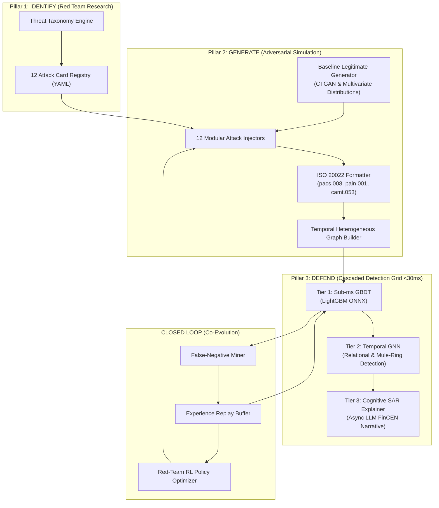

# Mastercard AI Defense Lab: Autonomous Closed-Loop Red/Blue Team System for Payment Security

[](https://www.python.org/downloads/)
[](https://fastapi.tiangolo.com)
[](https://lightgbm.readthedocs.io)
[](https://pytorch-geometric.readthedocs.io)
[](https://www.iso20022.org)

An end-to-end Adversarial AI Defense Grid built for the **Mastercard Innovation Challenge 2026** at the **Global Fintech Fest (GFF) 2026 (Jio World Centre, Mumbai)**.

The system closes the security loop across three foundational pillars: **Identify** (threat ideation & taxonomy), **Generate** (adversarial synthetic simulation), and **Defend** (cascaded sub-30ms detection grid with automated SAR explainability).

---

## 🏛️ System Architecture



---

## 🛡️ Pillar 1: Threat Taxonomy (12 Novel GenAI Attack Vectors)

| ID | Attack Name | Category | Primary Channel | GenAI Role & Technique |
|---|---|---|---|---|
| **ATK-001** | **Agentic Micro-Smurfing** | Structuring | CNP / Real-time | Autonomous LLM agent splits balances under reporting thresholds with jittered Dirichlet amounts. |
| **ATK-002** | **Deepfake Voice Authorization** | Voice Spoofing | Phone / SWIFT Wire | Zero-shot diffusion acoustic cloning bypassing IVR and wire-desk voice biometrics. |
| **ATK-003** | **Synthetic Identity Bust-Out** | Identity Synthesis | Card / Credit | Diffusion-forged KYC docs + 12-month automated credit building prior to zero-hour bust-out. |
| **ATK-004** | **ISO 20022 Metadata Tampering** | Metadata Tampering | RTGS / SWIFT | Homoglyphic Unicode substitutions in `RmtInf` & `Purp/Cd` creating parser differentials against AML filters. |
| **ATK-005** | **Behavioral Biometric Masquerade**| Behavioral Mimicry | Mobile CNP | TimeGAN synthesizing touch velocity, pressure curves, and micro-tremors to evade bot detection. |
| **ATK-006** | **Dynamic Mule Cycle Rings** | Mule Orchestration | P2P / Wire | Graph RL orchestrates dynamic re-wiring of ephemeral mule nodes and asymmetric decoy paths. |
| **ATK-007** | **LLM Spear Phishing (BEC)** | Social Engineering | Corporate Wire | Context-grounded LLM drafts invoice update lures matching executive tone and active ERP threads. |
| **ATK-008** | **Adversarial Feature Perturbation**| Adversarial ML | Card Switch | PGD / FGSM optimization computes minimal tabular feature shifts $\delta$ to cross classifier boundaries. |
| **ATK-009** | **Ghost Merchant & MCC Shifting** | Merchant Collusion| Acquiring / POS | Synthetic storefronts with dynamic MCC hopping to disguise illicit spend as grocery/retail. |
| **ATK-010** | **Cross-Border FX Layering** | Cross-Border | FX Remittance | Multi-agent rapid corridor hops (5 currencies in 12 min) exploiting settlement time lags. |
| **ATK-011** | **Token Replay on Mobile Wallets** | Token Exploitation | Mobile NFC | Replaying intercepted DPAN cryptograms with GAN-synthesized device hardware attestation tokens. |
| **ATK-012** | **Real-Time ATO Session Hijack** | Account Takeover | Open Banking API | AiTM reverse-proxy captures session cookies; agentic bot drains balance via PISP API in <5s. |

---

## 🚀 Quick Start

### 1. Prerequisites & Virtual Environment
```bash
# Clone the repository
git clone https://github.com/your-org/mastercard-ai-defense-lab.git
cd mastercard-ai-defense-lab

# Create Python 3.11 virtual environment
python3.11 -m venv .venv
source .venv/bin/activate

# Install dependencies
pip install -r requirements.txt
```

### 2. Environment Configuration
```bash
cp .env.example .env
# Edit .env and supply your GEMINI_API_KEY (optional, for Tier 3 SAR narrative generation)
```

### 3. Run Test Suite
```bash
pytest tests/ -v
```

---

## 📂 Repository Layout

```
Mastercard/
├── identify/              # Pillar 1: Threat taxonomy models & 12 YAML attack cards
│   ├── taxonomy.py        # Pydantic schemas (AttackCard, KillChainStage, DetectionSignal)
│   ├── loader.py          # Registry query engine & validation
│   └── registry/          # 12 detailed YAML attack definitions
├── generate/              # Pillar 2: Adversarial simulation & synthetic engines
│   ├── base_generator.py  # CTGAN / Multivariate legitimate transaction synthesizer
│   ├── iso20022_formatter.py # pacs.008, pain.001 XML message serializers
│   ├── graph_builder.py   # Heterogeneous temporal transaction graph constructor
│   ├── attack_injectors/  # 12 pluggable attack injection modules
│   └── pipeline.py        # Synthetic dataset generator & ground-truth labeling
├── defend/                # Pillar 3: Multi-tier cascading defense grid (<30ms)
│   ├── features/          # Tabular & temporal graph feature engineering
│   ├── tier1_gbdt/        # LightGBM / ONNX sub-millisecond classifier
│   ├── tier2_gnn/         # Temporal Graph Neural Network
│   ├── tier3_explainer/   # Async LLM-powered SAR generator
│   └── ensemble.py        # Cascading decision engine
├── closed_loop/           # Co-evolutionary feedback loop
│   ├── false_negative_miner.py # False negative mining engine
│   ├── replay_buffer.py   # Experience replay buffer
│   └── loop_orchestrator.py # Multi-epoch co-evolution coordinator
├── api/                   # High-throughput FastAPI engine & WebSocket streamer
├── web/                   # Next.js interactive fintech dashboard
├── tests/                 # Comprehensive test suite
└── pyproject.toml         # Project metadata & build configuration
```

---

## ⚖️ License
MIT License. Built for the Mastercard Innovation Challenge 2026.
